<!-- ===== Animated banner (local SVG, always works) ===== -->
<p align="center">
  
</p>

<!-- ===== Animated typing text ===== -->
<p align="center">
  
</p>

<!-- ===== Visitor counter (animated number) ===== -->
<p align="center">
  
</p>

---

<!-- ===== About ===== -->
<h2 align="center">👋 Hi there, I'm Cherry-toto</h2>

<p align="center">
  I'm a <b>PHP backend developer</b> who can also craft simple front-end pages.
  I'm capable of independently completing small to medium-sized projects end-to-end.
  Always happy to connect with new friends on GitHub — feel free to reach out! 📧
</p>

<div align="center">

```text
🛠  Backend     →  PHP · MySQL · EasySwoole · ThinkPHP · Laravel
🎨  Frontend    →  HTML · CSS · JavaScript · Vue · Element UI
🧰  Tooling     →  Git · GitHub · PHPStorm · VSCode · NotePad++
```

</div>

<p align="center">
  🔭 <b>Currently hacking on:</b> a TikTok-style short-video mobile app — PHP backend, infinite scroll & video curation.
</p>
<p align="center">
  ⚡ <b>Fun fact:</b> I can take a project from database schema all the way to deployment — solo.
</p>

---

<!-- ===== Tech stack icons ===== -->
<h2 align="center">🧩 Tech Stack</h2>

<p align="center">
  <a href="https://skillicons.dev">
    
  </a>
</p>

---

<!-- ===== Stats ===== -->
<h2 align="center">📊 GitHub Stats</h2>

<p align="center">
  
  
</p>

<p align="center">
  
</p>

---

<!-- ===== Trophies ===== -->
<h2 align="center">🏆 Trophies</h2>

<p align="center">
  
</p>

---

<!-- ===== Activity graph ===== -->
<h2 align="center">🌈 Contribution Activity</h2>

<p align="center">
  
</p>

---

<!-- ===== Contribution snake (animated) ===== -->
<h2 align="center">🐍 Contribution Snake</h2>

<p align="center">
  
</p>

---

<!-- ===== Connect ===== -->
<h2 align="center">📫 Let's Connect</h2>

<p align="center">
  <a href="mailto:2581047041@qq.com">
    
  </a>
  <a href="https://github.com/Cherry-toto">
    
  </a>
</p>

<p align="center">
  <i>“Code is poetry. Ship it with a smile.” ✨</i>
</p>

<!-- ===== Footer wave ===== -->
<p align="center">
  
</p>

<p align="center">
  
</p>
<p align="center">
  <sub>⚡ Profile crafted with 💙 · animated with SVG, live stats & GitHub Actions</sub>
</p>
